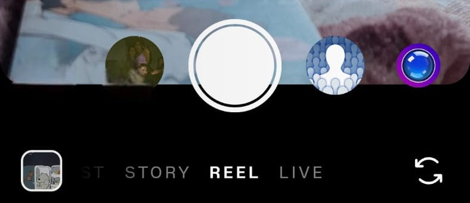
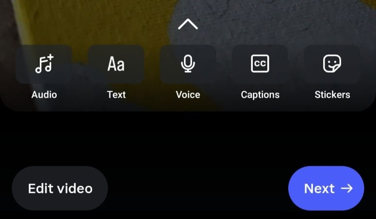
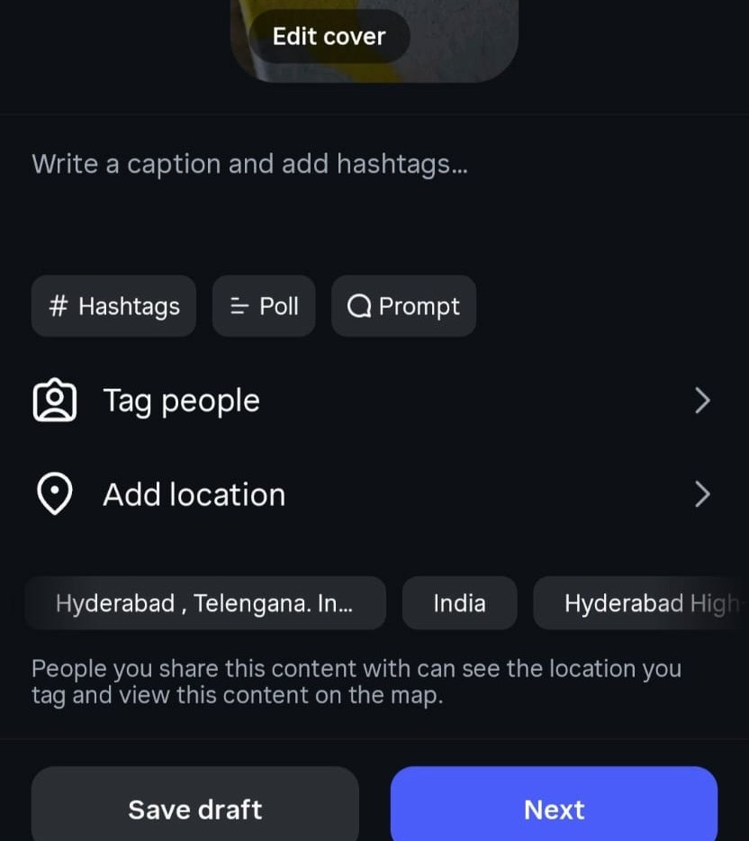
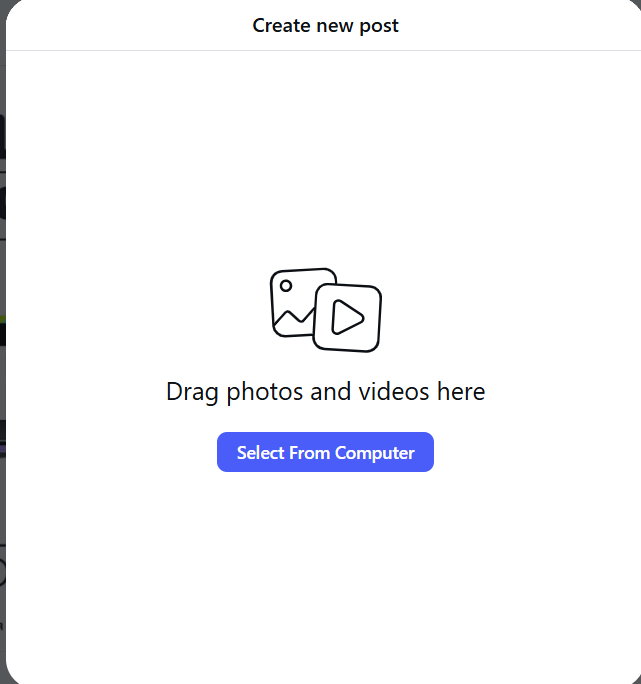
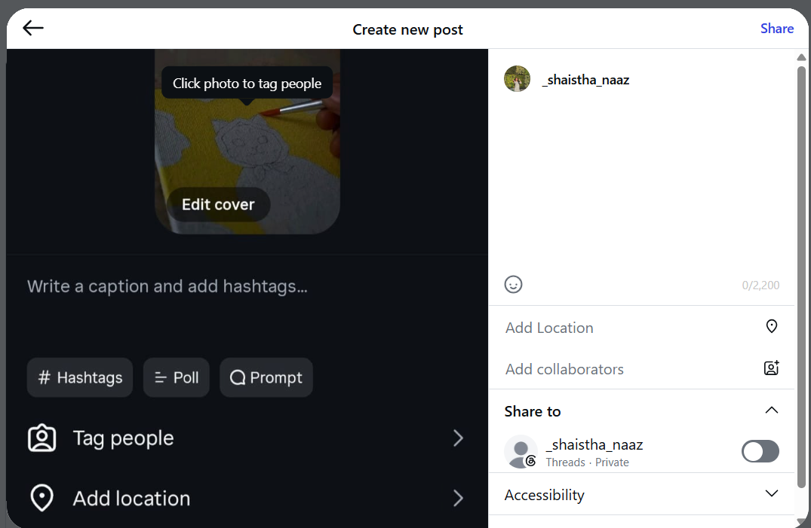

## Posting a Reel
This section describes the step-by-step instructions for posting an Instagram Reel using both the mobile application and the desktop website. Each procedure outlines the actions required to upload, customize, and publish a Reel, enabling users to choose the method that best suits their device and workflow.

### Before You Begin
Ensure the following requirements are met before creating a Reel:

- Install the latest version of Instagram.
- Sign in to your Instagram account.
- Allow camera and microphone permissions.
- Prepare the video or record one using the Instagram camera.
- Ensure you have an active internet connection.

Steps to post an Instagram reel through *mobile*:

1. Open **Instagram**
2. Tap the **(+) Create** button or swipe right from your Home feed.

3. Select **Reel** from the menu of post types.
  
4. Choose how to add your video:
    
    a. **Record:** Press and hold the Record button, release to stop recording. Repeat if multiple clips are needed.

    b. **Upload:** Tap the Gallery icon, select one or more videos.
    > Note: Edit your Reel you can add audio (music/Voice-over), trim, reorder, or replace any clip before moving on.

5. Tap **Next**.
6. To publish the Reel, perform the following steps:

    a. **Add a Caption:** Write a caption that describes your Reel.
    
    b. **Add Hashtags:** Add relevant hashtags to help people find your Reel.

    c. **Tag People:** Tag friends, collaborators, or brands related to the Reel.

    d. **Add a Location:** Select a location, such as a city, business, or event (optional). 

    e. **Choose a Cover Photo:** Select a frame from the video or add a custom cover image.

7. Tap **Next**, and then **Share** the video.

The Reel is uploaded and published to your profile.

> Note: Reels longer than 3 minutes are less likely to be recommended to new audiences. Shorter Reels generally perform better for discovery.

Steps to Post an Instagram Reel through *Desktop*: 

1. Open **https://www.instagram.com** in your web browser. 
  
2. Sign in to your Instagram account.
3. Click the **Create (+)** button from the left navigation menu.

4. Select **Post** 
    > Note: Instagram automatically recognizes supported vertical videos and allows them to be shared as a Reel.

5. Click **Select from computer** and choose the video you want to upload.

6. Adjust the video if required:

    a. Choose the aspect ratio.

    b. Crop or fit the video within the frame.
7. Review the uploaded video and click **Next**.
8.  To publish the Reel, perform the following steps:

    a. **Add a Caption:** Write a caption that describes your Reel.
    
    b. **Add Hashtags:** Add relevant hashtags to help people find your Reel.

    c. **Tag People:** Tag friends, collaborators, or brands.

    d. **Add a Location:** Select a city, business, or event (optional).

9.  Click **Share** to upload and publish the Reel.

> Note: Some editing features available on the mobile app, such as recording multiple clips, adding music from Instagram's library, AR effects, stickers, and advanced editing tools, may not be available when posting from a desktop browser.